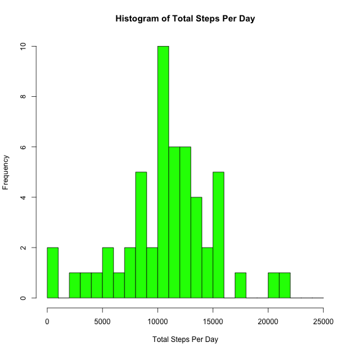
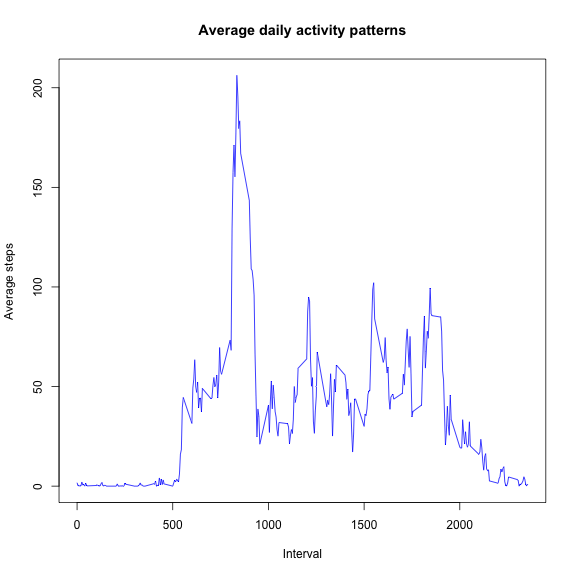
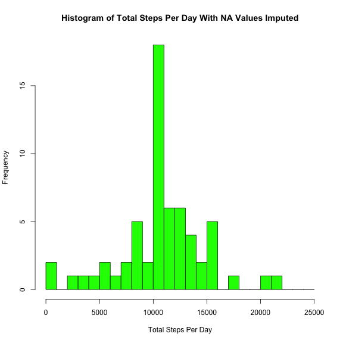
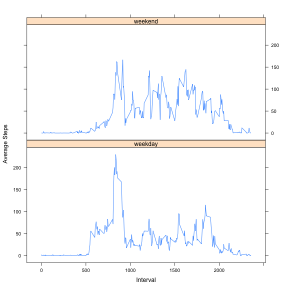

# Reproducible Research: Peer Assessment 1


## Loading and preprocessing the data

### Load the data

```r
filenames <- unzip("activity.zip")
data <- read.csv(filenames[1])
```


### Preprocess the data to convert the date values to POSIX dates

```r
data$date <- as.Date(data$date)
str(data)
```

```
## 'data.frame':	17568 obs. of  3 variables:
##  $ steps   : int  NA NA NA NA NA NA NA NA NA NA ...
##  $ date    : Date, format: "2012-10-01" "2012-10-01" ...
##  $ interval: int  0 5 10 15 20 25 30 35 40 45 ...
```

```r
summary(data)
```

```
##      steps            date               interval   
##  Min.   :  0.0   Min.   :2012-10-01   Min.   :   0  
##  1st Qu.:  0.0   1st Qu.:2012-10-16   1st Qu.: 589  
##  Median :  0.0   Median :2012-10-31   Median :1178  
##  Mean   : 37.4   Mean   :2012-10-31   Mean   :1178  
##  3rd Qu.: 12.0   3rd Qu.:2012-11-15   3rd Qu.:1766  
##  Max.   :806.0   Max.   :2012-11-30   Max.   :2355  
##  NA's   :2304
```


## What is the mean total number of steps taken per day?

### Determine the total number of steps taken each day

```r
require(plyr)
summed.by.day <- ddply(data, .(date), summarize, sum = sum(steps))
summary(summed.by.day)
```

```
##       date                 sum       
##  Min.   :2012-10-01   Min.   :   41  
##  1st Qu.:2012-10-16   1st Qu.: 8841  
##  Median :2012-10-31   Median :10765  
##  Mean   :2012-10-31   Mean   :10766  
##  3rd Qu.:2012-11-15   3rd Qu.:13294  
##  Max.   :2012-11-30   Max.   :21194  
##                       NA's   :8
```


### Make a histogram of the total number of steps taken each day

```r
hist(summed.by.day$sum, breaks = seq(from = 0, to = 25000, by = 1000), col = "green", 
    main = "Histogram of Total Steps Per Day", xlab = "Total Steps Per Day")
```




### Calculate the mean and median

```r
mean.steps.per.day <- format(mean(summed.by.day$sum, na.rm = TRUE), scientific = FALSE, 
    nsmall = 0)
median.steps.per.day <- format(median(summed.by.day$sum, na.rm = TRUE), scientific = FALSE, 
    nsmall = 0)
```


The mean number of steps per day is **10766**.
The median number of steps per day is **10765**.

## What is the average daily activity pattern?

### Determine the average steps taken during each interval

```r
avg.by.interval <- ddply(data, .(interval), summarize, avg = mean(steps, na.rm = TRUE))
summary(avg.by.interval)
```

```
##     interval         avg        
##  Min.   :   0   Min.   :  0.00  
##  1st Qu.: 589   1st Qu.:  2.49  
##  Median :1178   Median : 34.11  
##  Mean   :1178   Mean   : 37.38  
##  3rd Qu.:1766   3rd Qu.: 52.83  
##  Max.   :2355   Max.   :206.17
```


### Make a time series plot of average number of steps by interval

```r
plot(x = avg.by.interval$interval, y = avg.by.interval$avg, type = "l", col = "blue", 
    main = "Average daily activity patterns", xlab = "Interval", ylab = "Average steps")
```




### Determine the 5-minute interval, on average across all the days in the dataset, which contains the maximum number of steps

```r
top.interval <- avg.by.interval[avg.by.interval$avg == max(avg.by.interval$avg), 
    ]$interval
print(top.interval)
```

```
## [1] 835
```


The 5-minute interval, on average across all the days in the dataset, which contains the maximum number of steps is **835**.

## Imputing missing values

### Calculate and report the total number of missing values


```r
missing <- sum(is.na(data$steps) == TRUE)
print(missing)
```

```
## [1] 2304
```


The total number of missing values is **2304**.

### Devise a strategy for filling in all of the missing values in the dataset

Consider imputing missing values with the average steps across all intervals 
in a day.


```r
mean.by.day <- ddply(data, .(date), summarize, mean = mean(steps, na.rm = TRUE))
summary(mean.by.day)
```

```
##       date                 mean      
##  Min.   :2012-10-01   Min.   : 0.14  
##  1st Qu.:2012-10-16   1st Qu.:30.70  
##  Median :2012-10-31   Median :37.38  
##  Mean   :2012-10-31   Mean   :37.38  
##  3rd Qu.:2012-11-15   3rd Qu.:46.16  
##  Max.   :2012-11-30   Max.   :73.59  
##                       NA's   :8
```


The difficulty with this approach is that some entire days have no data,
as indicated by the NA's in the daily means (above).

Thus, consider using the average for the same interval across all days.


```r
avg.by.interval <- ddply(data, .(interval), summarize, avg = mean(steps, na.rm = TRUE))
summary(avg.by.interval)
```

```
##     interval         avg        
##  Min.   :   0   Min.   :  0.00  
##  1st Qu.: 589   1st Qu.:  2.49  
##  Median :1178   Median : 34.11  
##  Mean   :1178   Mean   : 37.38  
##  3rd Qu.:1766   3rd Qu.: 52.83  
##  Max.   :2355   Max.   :206.17
```


This seems like the better approach, since there are no NA's in the interval
means, *and* this approach will gracefully handle the days with no step data 
at all by imputing them with the "typical day".

### Create a new dataset with the missing data filled in


```r
interval.means <- ddply(data, .(interval), summarize, avg = mean(steps, na.rm = TRUE))
impute <- function(steps, interval, interval.means) {
    if (!is.na(steps)) {
        return(steps)
    } else {
        return(interval.means[interval.means[, 1] == interval, 2])
    }
}
new.data <- data
new.data$steps <- mapply(impute, data$steps, data$interval, MoreArgs = list(interval.means))
str(new.data)
```

```
## 'data.frame':	17568 obs. of  3 variables:
##  $ steps   : num  1.717 0.3396 0.1321 0.1509 0.0755 ...
##  $ date    : Date, format: "2012-10-01" "2012-10-01" ...
##  $ interval: int  0 5 10 15 20 25 30 35 40 45 ...
```

```r
summary(new.data)
```

```
##      steps            date               interval   
##  Min.   :  0.0   Min.   :2012-10-01   Min.   :   0  
##  1st Qu.:  0.0   1st Qu.:2012-10-16   1st Qu.: 589  
##  Median :  0.0   Median :2012-10-31   Median :1178  
##  Mean   : 37.4   Mean   :2012-10-31   Mean   :1178  
##  3rd Qu.: 27.0   3rd Qu.:2012-11-15   3rd Qu.:1766  
##  Max.   :806.0   Max.   :2012-11-30   Max.   :2355
```


### Determine the new total number of steps taken each day

```r
require(plyr)
summed.by.day.imputed <- ddply(new.data, .(date), summarize, sum = sum(steps))
summary(summed.by.day.imputed)
```

```
##       date                 sum       
##  Min.   :2012-10-01   Min.   :   41  
##  1st Qu.:2012-10-16   1st Qu.: 9819  
##  Median :2012-10-31   Median :10766  
##  Mean   :2012-10-31   Mean   :10766  
##  3rd Qu.:2012-11-15   3rd Qu.:12811  
##  Max.   :2012-11-30   Max.   :21194
```


### Make a histogram of the new total number of steps taken each day

```r
hist(summed.by.day.imputed$sum, breaks = seq(from = 0, to = 25000, by = 1000), 
    col = "green", main = "Histogram of Total Steps Per Day With NA Values Imputed", 
    xlab = "Total Steps Per Day")
```




### Calculate the new mean and median

```r
mean.steps.per.day.imputed <- format(mean(summed.by.day.imputed$sum), scientific = FALSE, 
    nsmall = 0)
median.steps.per.day.imputed <- format(median(summed.by.day.imputed$sum), scientific = FALSE, 
    nsmall = 0)
```


The mean number of steps per day with NA values imputed is **10766**.
The median number of steps per day with NA values imputed is **10766**.

Thus, the impact of imputing missing data, using the strategy defined above,
on the estimates of the total daily number of steps is that *the mean is unchanged* 
and the *median is slightly higher* (and actually equal to the mean) when missing 
data is imputed.

## Are there differences in activity patterns between weekdays and weekends?

### Create a new factor variable indicating if a given date is a weekday or weekend day.


```r
new.data$weekday.or.weekend <- as.factor(ifelse(grepl("^S", weekdays(data$date)), 
    yes = "weekend", no = "weekday"))
summary(new.data)
```

```
##      steps            date               interval    weekday.or.weekend
##  Min.   :  0.0   Min.   :2012-10-01   Min.   :   0   weekday:12960     
##  1st Qu.:  0.0   1st Qu.:2012-10-16   1st Qu.: 589   weekend: 4608     
##  Median :  0.0   Median :2012-10-31   Median :1178                     
##  Mean   : 37.4   Mean   :2012-10-31   Mean   :1178                     
##  3rd Qu.: 27.0   3rd Qu.:2012-11-15   3rd Qu.:1766                     
##  Max.   :806.0   Max.   :2012-11-30   Max.   :2355
```


### Determine the average steps taken during each interval

```r
avg.by.interval <- ddply(new.data, .(weekday.or.weekend, interval), summarize, 
    avg = mean(steps, na.rm = TRUE))
summary(avg.by.interval)
```

```
##  weekday.or.weekend    interval         avg        
##  weekday:288        Min.   :   0   Min.   :  0.00  
##  weekend:288        1st Qu.: 589   1st Qu.:  2.05  
##                     Median :1178   Median : 28.13  
##                     Mean   :1178   Mean   : 38.99  
##                     3rd Qu.:1766   3rd Qu.: 61.26  
##                     Max.   :2355   Max.   :230.38
```


### Create a panel plot comparing average daily activity pattern between weekdays and weekends

```r
require(lattice)
xyplot(avg ~ interval | weekday.or.weekend, avg.by.interval, type = "l", layout = c(1, 
    2), xlab = "Interval", ylab = "Average Steps")
```



